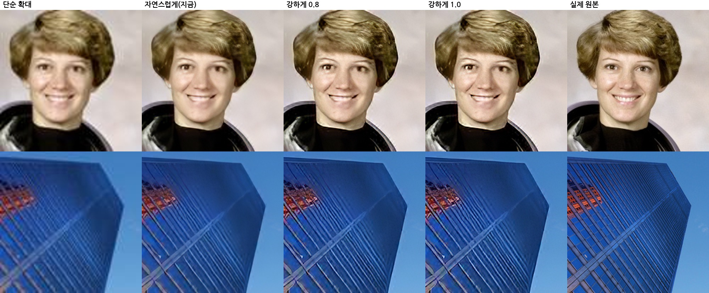

# AI 화질 개선 모델

`public/models/fidelity-x4.onnx`(반정밀도판 `fidelity-x4-fp16.onnx`)는 두 부분으로 되어 있습니다.

1. **Real-ESRGAN `realesr-general-wdn-x4v3`**: 사진을 4배로 키우며 선명하게 만드는 신경망(5MB).
2. **충실도 보정(역투영, `fidelity.py`)**: AI 결과를 원래 크기로 다시 줄여 원본과 비교하고, 차이만큼 되돌려 고치기를 3번 합니다.
   AI가 원본에 없는 무늬를 지어내거나 모양·색을 바꾸면 줄였을 때 원본과 달라지므로, 이 단계에서 걸러집니다.
   - 무손실 원본(PNG·BMP·TIFF·GIF): 원본과 그대로 맞춥니다 (`core=0, soft=0`).
   - 손실 압축 원본(JPEG·WEBP·HEIC·동영상): 압축 흔적·잡음까지 되살리지 않도록, 작은 차이(1.5% 이하)는 무시하고 큰 차이만 고칩니다 (`core=0.015, soft=1`).

보정은 모델 안에 고정된 합성곱으로 들어 있어 그래픽카드에서 AI와 함께 한 번에 계산됩니다(추가 시간 1% 미만).

## 측정 결과

표준 초해상도 시험 사진 31장(Set5, Set14, Urban100 12장)을 1/4로 줄였다가 4배로 키워 원본과 비교했습니다 (`evaluate.py`).

- **PSNR·SSIM**: 원본과 얼마나 같은지 (높을수록 좋음)
- **LPIPS**: 사람 눈에 원본과 얼마나 달라 보이는지 (낮을수록 좋음)
- **일치**: 결과를 다시 줄였을 때 원본과 같은 정도, dB (높을수록 왜곡이 적음)

| 원본 상태 | 방법 | PSNR | SSIM | LPIPS | 일치 |
|---|---|---:|---:|---:|---:|
| 깨끗함 | 단순 확대(바이큐빅) | 25.67 | 0.712 | 0.431 | 38.8 |
| | 기존 동영상용(general-x4v3) | 24.28 | 0.729 | 0.276 | 30.2 |
| | 기존 사진용(x4plus, 67MB) | 24.56 | 0.716 | 0.223 | 32.0 |
| | **새 모델** | **26.25** | **0.749** | **0.188** | **52.5** |
| JPEG(품질 70) | 단순 확대(바이큐빅) | 24.91 | 0.655 | 0.551 | 33.9 |
| | 기존 동영상용 | 23.38 | **0.683** | 0.310 | 28.6 |
| | 기존 사진용 | 23.64 | 0.670 | 0.251 | 30.1 |
| | **새 모델** | **24.86** | 0.675 | **0.247** | **34.5** |
| 흐림+잡음+JPEG(품질 45) | 단순 확대(바이큐빅) | 23.71 | 0.592 | 0.636 | 29.6 |
| | 기존 동영상용 | 22.88 | **0.637** | 0.360 | 27.5 |
| | 기존 사진용 | 23.02 | 0.627 | **0.296** | 28.4 |
| | **새 모델** | **23.89** | 0.604 | 0.322 | **30.8** |

기존 AI 모델들은 선명해 보이지만 단순 확대보다도 원본과 덜 같았습니다(PSNR이 더 낮음). 새 모델은 원본과의 일치도와 선명도가 함께 좋아졌습니다.
아주 심하게 망가진 사진에서는 기존 사진용 모델이 조금 더 선명해 보이지만(LPIPS), 그만큼 원본에 없는 것을 지어냅니다.

위 비교(JPEG 원본을 4배 확대)에서 기존 모델은 눈·피부 모양을 바꾸고 창문 격자를 가로줄로 바꿔 버렸지만, 새 모델은 원래 모양을 지킵니다.

### 검토했지만 쓰지 않은 것
- `RealESRNet_x4plus`(원본 일치 위주 학습): PSNR은 가장 높지만 흐릿해서(LPIPS 0.30) 화질 개선 효과가 약합니다.
- general과 wdn 모델 가중치 섞기: 모든 지표에서 wdn 단독보다 나쁩니다.
- 입력 잡음을 추정해 보정 세기를 자동으로 정하기: 잡음 추정이 사진의 질감과 잡음을 구분하지 못해, 파일 형식(무손실/손실)으로 정하는 편이 더 정확했습니다.

## '강하게' 모드

1080p처럼 이미 괜찮은 영상을 키우면(4K 제한 때문에 실제로는 2배) 효과가 작게 느껴집니다.
같은 상황(사진을 절반으로 줄였다가 2배로 키움, JPEG 품질 85/60)에서 재 보니, 보정된 AI 결과는 실제 원본보다 윤곽이 약했습니다
(고주파 세기: 원본 1.0, AI 결과 0.70~0.74). 그래서 '강하게'는 결과에 윤곽 강조(언샤프 마스크, 세기 1.0, 최종 크기 기준 반경 1화소)를 더합니다.
강조도 모델 안에서 계산하므로(`sharp`, `radius` 입력) 그래픽카드에서 함께 처리됩니다. `sharp=0`이면 '자연스럽게'와 결과가 완전히 같습니다.

| 원본 | 방법 | PSNR | SSIM | LPIPS | 윤곽 세기 |
|---|---|---:|---:|---:|---:|
| JPEG 85 | 단순 확대 | 29.22 | 0.842 | 0.240 | 0.49 |
| | 자연스럽게 | **29.77** | **0.859** | **0.124** | 0.74 |
| | 강하게(1.0) | 26.53 | 0.818 | 0.133 | **1.17** |
| JPEG 60 (동영상 수준) | 단순 확대 | 28.12 | 0.800 | 0.304 | 0.48 |
| | 자연스럽게 | **28.70** | **0.821** | 0.163 | 0.70 |
| | 강하게(1.0) | 26.02 | 0.778 | **0.160** | **1.12** |

강하게는 원본과의 화소 단위 일치(PSNR)는 낮아지지만, 사람 눈 기준 차이(LPIPS)는 비슷하거나 더 낫고 윤곽은 원본 수준 이상으로 또렷해집니다.
윤곽 주변만 강조하는 방식(잡음 문턱)과 더 넓은 반경도 시험했지만 LPIPS가 더 나빠 쓰지 않았습니다.

## 동영상 속도

| 방법 | 효과 |
|---|---|
| 브라우저(WebCodecs)가 동영상을 직접 풀고 묶기 ([Mediabunny](https://mediabunny.dev/)) | 크롬·엣지에서는 ffmpeg(약 10MB)를 받지도 않는다. 풀기·묶기를 그래픽카드 하드웨어가 한다. 소리는 다시 압축하지 않고 그대로 옮긴다 |
| AI 결과를 그래픽카드 안에서 바로 그림으로 바꾸기 (WebGPU 셰이더) | 4배 크기의 소수 수백만 개를 CPU로 가져와 한 칸씩 옮기던 과정이 없어지고, 가져오는 양도 3분의 1로 준다 |
| 반정밀도(fp16) 모델 (그래픽카드가 지원할 때) | 보통 1.5~2배. 결과 차이 평균 0.1/255 |
| 그래픽카드에서는 작은 영상을 조각내지 않고 한 번에 계산 | 조각 경계 겹침·호출 횟수 감소 |
| 멈춘 장면(앞 장면과 같음)은 AI 계산을 건너뛰고 재사용 | 2초 정지+1초 움직임 영상: 130초 → 66초 |
| CPU 계산 시 모든 코어 사용 (기본값은 절반) | 800×600 사진 2배: 45초 → 23초 |
| 브라우저가 못 푸는 형식(AVI 등)은 ffmpeg로: 압축 없는 화소로 주고받기 | PNG 압축·풀기 시간 제거 |
| 그때 브라우저 인코더도 없으면 여러 코어용 ffmpeg로 인코딩 | 1080p 60장면 인코딩 3.5초 → 1.6초 (4코어, 2.3배). 풀기는 거의 같다 |

### 이 저장소의 테스트 환경에서 잰 값 (4코어 CPU, 그래픽카드 없음)

- 256×144 3초(90장면) 영상 2배: 처음 버전 237초 → 지금 약 130초. 거의 전부가 CPU의 AI 계산 시간이다.
- 640×360 → 1280×720, 15장면: AI 계산 약 138초, 그 밖의 처리(풀기·그리기·묶기) 3.8초(브라우저 경로)~5.0초(ffmpeg 경로).
  CPU만으로는 AI 계산이 99% 이상이라 나머지를 줄여도 전체 시간은 거의 같다.
- AI 계산이 작은 짧은 영상(96×54 → 192×108, 60장면)에서는 차이가 그대로 보인다: 브라우저 경로 11.6초, ffmpeg 경로 21.7초.
- 그래픽카드 경로는 결과가 CPU와 같음(최대 1/255 차이)을 소프트웨어 그래픽카드로 확인했지만, 실제 그래픽카드에서의 속도는 잴 수 없었다.
  그래픽카드에서는 AI 계산이 수십~수백 배 빨라지므로 위의 나머지 처리를 줄인 효과가 전체 시간에 크게 드러난다.

### 시도했지만 쓰지 않은 것: 동영상 전용 가벼운 모델

합성곱 층을 32개에서 16개로 줄인 모델을 지금 모델의 결과를 따라 하도록 학습(증류)시켜 봤다.
BSD100 + Urban100 일부 188장, 2,500단계(CPU 약 1시간), 평균 차이 + 윤곽 차이 + LPIPS 손실.

| 원본 상태 | 모델 | PSNR | SSIM | LPIPS | 속도 |
|---|---|---:|---:|---:|---:|
| 깨끗함 | 지금 모델(32층) | 26.25 | 0.749 | **0.188** | 1배 |
| | 16층 | **26.54** | 0.746 | 0.208 | **2배** |
| JPEG | 지금 모델 | 24.86 | 0.675 | **0.247** | |
| | 16층 | **25.27** | 0.677 | 0.291 | |
| 흐림+잡음+JPEG | 지금 모델 | 23.89 | 0.604 | **0.322** | |
| | 16층 | **24.14** | 0.615 | 0.366 | |

2배 빠르고 원본 일치(PSNR)도 높았지만, 눈으로 보면 JPEG 압축의 네모난 깨짐을 덜 지워서 얼굴·물결 같은 곳이 지저분하게 남았다.
"화질이 확실히 좋아져야 한다"는 목표에 못 미쳐 쓰지 않았다. 더 큰 학습 자료(DIV2K 등)와 그래픽카드 학습이면 나아질 여지가 있다.
