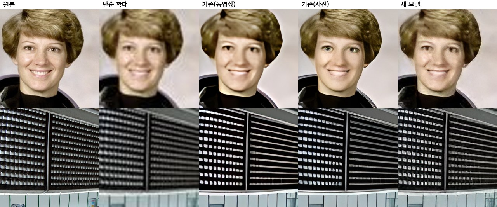

# AI 화질 개선 모델

`public/models/fidelity-x4.onnx`(반정밀도판 `fidelity-x4-fp16.onnx`)는 두 부분으로 되어 있습니다.

1. **Real-ESRGAN `realesr-general-wdn-x4v3`**: 사진을 4배로 키우며 선명하게 만드는 신경망(5MB).
2. **충실도 보정(역투영, `fidelity.py`)**: AI 결과를 원래 크기로 다시 줄여 원본과 비교하고, 차이만큼 되돌려 고치기를 3번 합니다.
   AI가 원본에 없는 무늬를 지어내거나 모양·색을 바꾸면 줄였을 때 원본과 달라지므로, 이 단계에서 걸러집니다.
   - 무손실 원본(PNG·BMP·TIFF·GIF): 원본과 그대로 맞춥니다 (`core=0, soft=0`).
   - 손실 압축 원본(JPEG·WEBP·HEIC·동영상): 압축 흔적·잡음까지 되살리지 않도록, 작은 차이(1.5% 이하)는 무시하고 큰 차이만 고칩니다 (`core=0.015, soft=1`).

보정은 모델 안에 고정된 합성곱으로 들어 있어 그래픽카드에서 AI와 함께 한 번에 계산됩니다(추가 시간 1% 미만).

## 측정 결과

표준 초해상도 시험 사진 31장(Set5, Set14, Urban100 12장)을 1/4로 줄였다가 4배로 키워 원본과 비교했습니다 (`evaluate.py`).

- **PSNR·SSIM**: 원본과 얼마나 같은지 (높을수록 좋음)
- **LPIPS**: 사람 눈에 원본과 얼마나 달라 보이는지 (낮을수록 좋음)
- **일치**: 결과를 다시 줄였을 때 원본과 같은 정도, dB (높을수록 왜곡이 적음)

| 원본 상태 | 방법 | PSNR | SSIM | LPIPS | 일치 |
|---|---|---:|---:|---:|---:|
| 깨끗함 | 단순 확대(바이큐빅) | 25.67 | 0.712 | 0.431 | 38.8 |
| | 기존 동영상용(general-x4v3) | 24.28 | 0.729 | 0.276 | 30.2 |
| | 기존 사진용(x4plus, 67MB) | 24.56 | 0.716 | 0.223 | 32.0 |
| | **새 모델** | **26.25** | **0.749** | **0.188** | **52.5** |
| JPEG(품질 70) | 단순 확대(바이큐빅) | 24.91 | 0.655 | 0.551 | 33.9 |
| | 기존 동영상용 | 23.38 | **0.683** | 0.310 | 28.6 |
| | 기존 사진용 | 23.64 | 0.670 | 0.251 | 30.1 |
| | **새 모델** | **24.86** | 0.675 | **0.247** | **34.5** |
| 흐림+잡음+JPEG(품질 45) | 단순 확대(바이큐빅) | 23.71 | 0.592 | 0.636 | 29.6 |
| | 기존 동영상용 | 22.88 | **0.637** | 0.360 | 27.5 |
| | 기존 사진용 | 23.02 | 0.627 | **0.296** | 28.4 |
| | **새 모델** | **23.89** | 0.604 | 0.322 | **30.8** |

기존 AI 모델들은 선명해 보이지만 단순 확대보다도 원본과 덜 같았습니다(PSNR이 더 낮음). 새 모델은 원본과의 일치도와 선명도가 함께 좋아졌습니다.
아주 심하게 망가진 사진에서는 기존 사진용 모델이 조금 더 선명해 보이지만(LPIPS), 그만큼 원본에 없는 것을 지어냅니다.

위 비교(JPEG 원본을 4배 확대)에서 기존 모델은 눈·피부 모양을 바꾸고 창문 격자를 가로줄로 바꿔 버렸지만, 새 모델은 원래 모양을 지킵니다.

### 검토했지만 쓰지 않은 것
- `RealESRNet_x4plus`(원본 일치 위주 학습): PSNR은 가장 높지만 흐릿해서(LPIPS 0.30) 화질 개선 효과가 약합니다.
- general과 wdn 모델 가중치 섞기: 모든 지표에서 wdn 단독보다 나쁩니다.
- 입력 잡음을 추정해 보정 세기를 자동으로 정하기: 잡음 추정이 사진의 질감과 잡음을 구분하지 못해, 파일 형식(무손실/손실)으로 정하는 편이 더 정확했습니다.

## 동영상 속도

| 방법 | 효과 |
|---|---|
| 장면을 PNG 대신 압축 없는 화소로 주고받기 | PNG 압축·풀기 시간 제거 |
| CPU 계산 시 모든 코어 사용 (기본값은 절반) | CPU에서 AI 계산이 빨라짐 (800×600 사진 2배: 45초 → 23초) |
| 멈춘 장면(앞 장면과 같음)은 AI 계산을 건너뛰고 재사용 | 정지 화면이 많은 영상에서 그만큼 빨라짐 (2초 정지+1초 움직임: 130초 → 66초) |
| 그래픽카드 동영상 인코더(WebCodecs H.264)로 저장 | ffmpeg(단일 스레드 libx264) 대신 하드웨어 인코딩. 4K에서 특히 큼 |
| 반정밀도(fp16) 모델 (그래픽카드가 지원할 때) | 보통 1.5~2배. 결과 차이 평균 0.1/255 |
| 그래픽카드에서는 작은 영상을 조각내지 않고 한 번에 계산 | 조각 경계 겹침·호출 횟수 감소 |

CPU만 있는 4코어 환경에서 위 변경을 모두 합한 결과: 256×144 3초 영상 2배 확대 237초 → 130초 (1.8배).
그래픽카드에서의 실제 속도는 이 저장소의 테스트 환경(그래픽카드 없음)에서는 잴 수 없었습니다.

더 빠르게 할 수 있는 남은 방법 (아직 안 함):
- **WebCodecs 디코딩**: 입력 영상도 그래픽카드로 풀기 (mp4 분해 라이브러리 필요, 오픈소스 크로미움에서는 테스트 불가).
- **그래픽카드 안에서 끝내기**: 지금은 AI 결과를 CPU로 가져와 캔버스에 그립니다. WebGPU 버퍼 → 동영상 프레임으로 바로 넘기면 복사가 줄어듭니다.
- **더 작은 동영상 전용 모델**: 합성곱 층을 32개 → 16개로 줄이면 약 2배 빨라지지만, 품질을 지키려면 직접 학습해야 합니다.
- **멀티스레드 ffmpeg**: 그래픽카드 인코더가 없는 브라우저에서 인코딩이 2~3배 빨라집니다.
